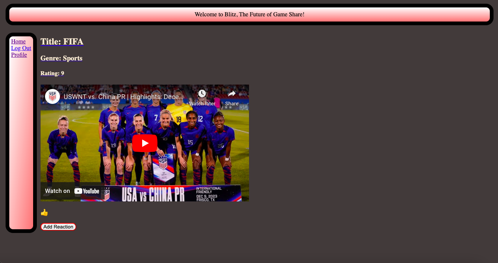

# Blitz

## Description

The motivation for this project was to create a social media site for gaming. We built it to exclusively provide a site for gamers to connect. Through the site, gamers can post about what they are currently playing and then react to each others post. There is also a rating system, so this can let others know the thoughts about each game. We learned a lot about creating log-in pages and reactions on posts.

## Installation

Run npm init -i and npm i to install basic dependencies. Must also have the bcrypt, connect-session-sequelize, dotenv, express, express-handlebars, express-session, mysql2, and sequelize dependencies. Also used npm i nodemon -D for further testing.

Must use SOURCE schema.sql to add the database, then run the program using npm run dev.

## Usage

## Application Link

## Credits

- William Tsai (github.com/1ncarnat10n), https://github.com/1ncarnat10n
- Sabrina Giannette (github.com/sgiannette), https://github.com/sgiannette
- Denise Vasquez (github.com/deemonroee), https://github.com/deemonroee
- Majd Hamdallah (github.com/Majdhamdallah4), https://github.com/Majdhamdallah4
- Kahlil Bausley (github.com/kahlilbausley), https://github.com/kahlilbausley
